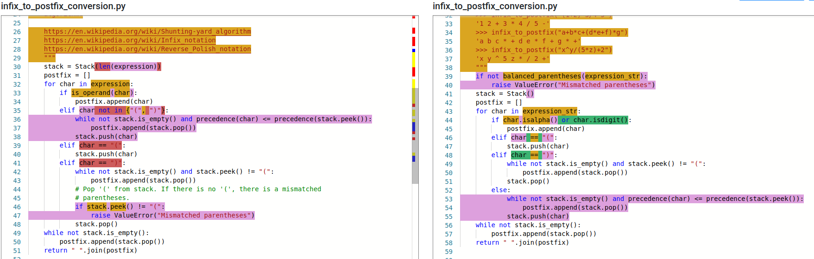

# Pilot Experiments

Here, we conduct a preliminary experimentation.

In the following text, `v0` refers to the program before the changes, and `v1` refers
to the program after the changes. On diff, `v0` is on the left, while `v1` is on the right.

## First example

### Overview

We will use a slightly modified version of this [pull-request](https://github.com/TheAlgorithms/Python/pull/3817).
The used branch are avalaible [here (v0)](https://github.com/danglotb/Python/tree/commit-0-v0) and [here (v1)](https://github.com/danglotb/Python/tree/commit-0-v1).

The `webdiff` by gumtree is the following:



IMO, the most impactful changes, is that in `v1`, the balance of the parenthesis
is checked before the process, while in `v0`, it is checked during the process.

### Traces V1

Omitting the check at the begin of `v1`, the algorithm starts as follow for both versions:

#### Initialization

[v0](https://github.com/danglotb/green-tracer/blob/master/experiments/pilot_11_2020/output/traces_0_v1#L38)

```text
<string>:__main__:infix_to_postfix:30:expression=a+b*(c^d-e)^(f+g*h)-i
PythonV0/data_structures/stacks/stack.py:stack:__init__:14:self,limit=21
PythonV0/data_structures/stacks/stack.py:stack:__init__:15:self,limit=21
PythonV0/data_structures/stacks/stack.py:stack:__init__:16:self=[],limit=21
PythonV0/data_structures/stacks/stack.py:stack:__init__:16:self=[],limit=21
<string>:__main__:infix_to_postfix:31:expression=a+b*(c^d-e)^(f+g*h)-i,stack=[]
<string>:__main__:infix_to_postfix:32:expression=a+b*(c^d-e)^(f+g*h)-i,stack=[],postfix=[]
```

[v1](https://github.com/danglotb/green-tracer/blob/master/experiments/pilot_11_2020/output/traces_1_v1#L141)

```text
<string>:__main__:infix_to_postfix:41:expression_str=a+b*(c^d-e)^(f+g*h)-i
Python/data_structures/stacks/stack.py:stack:__init__:14:self,limit=10
Python/data_structures/stacks/stack.py:stack:__init__:15:self,limit=10
Python/data_structures/stacks/stack.py:stack:__init__:16:self=[],limit=10
Python/data_structures/stacks/stack.py:stack:__init__:16:self=[],limit=10
<string>:__main__:infix_to_postfix:42:expression_str=a+b*(c^d-e)^(f+g*h)-i,stack=[]
<string>:__main__:infix_to_postfix:43:expression_str=a+b*(c^d-e)^(f+g*h)-i,stack=[],postfix=[]
```

Here, the main difference, is that the `stack` is constructed with the `len(expressions)`
in `v0`, while it uses the default size in `v1`.

```diff
- stack = Stack(len(expression))
+ stack = Stack()
```
#### First round of the loop

[v0](https://github.com/danglotb/green-tracer/blob/master/experiments/pilot_11_2020/output/traces_0_v1#L44)

```text
<string>:__main__:infix_to_postfix:32:expression=a+b*(c^d-e)^(f+g*h)-i,stack=[],postfix=[]
<string>:__main__:infix_to_postfix:33:expression=a+b*(c^d-e)^(f+g*h)-i,stack=[],postfix=[],char=a
<string>:__main__:is_operand:8:char=a
<string>:__main__:is_operand:9:char=a
<string>:__main__:is_operand:9:char=a
<string>:__main__:infix_to_postfix:34:expression=a+b*(c^d-e)^(f+g*h)-i,stack=[],postfix=[],char=a
<string>:__main__:infix_to_postfix:32:expression=a+b*(c^d-e)^(f+g*h)-i,stack=[],postfix=['a'],char=a
<string>:__main__:infix_to_postfix:33:expression=a+b*(c^d-e)^(f+g*h)-i,stack=[],postfix=['a'],char=+
```

[v1](https://github.com/danglotb/green-tracer/blob/master/experiments/pilot_11_2020/output/traces_1_v1#L147)

```text
<string>:__main__:infix_to_postfix:43:expression_str=a+b*(c^d-e)^(f+g*h)-i,stack=[],postfix=[]
<string>:__main__:infix_to_postfix:44:expression_str=a+b*(c^d-e)^(f+g*h)-i,stack=[],postfix=[],char=a
<string>:__main__:infix_to_postfix:45:expression_str=a+b*(c^d-e)^(f+g*h)-i,stack=[],postfix=[],char=a
<string>:__main__:infix_to_postfix:43:expression_str=a+b*(c^d-e)^(f+g*h)-i,stack=[],postfix=['a'],char=a
```

Here, we can see the call to the function `is_operand()` in `v0`, while in `v1`,
both std functions `isalpha()` and `isdigit()` are calles.

```diff
- if is_operand(char):
+ if char.isalpha() or char.isdigit():
  postfix.append(char)
```

### Traces V2

#### Initialization

In the `v2` of `green-tracer`, the tracer is injected within the code instead of
letting `green-tracer` executes the code. In this new version of `green-tracer`,
we have the path of the file containing the code, the modules and the function.
We have also the code executed.

[v0](https://github.com/danglotb/green-tracer/blob/master/experiments/pilot_11_2020/output/traces_0_v2#L2)

```text
PythonV0/data_structures/stacks/infix_to_postfix_conversion.py:__main__:infix_to_postfix:32 {    stack = Stack(len(expression))} (expression=a+b*(c^d-e)^(f+g*h)-i)
PythonV0/data_structures/stacks/stack.py:data_structures.stacks.stack:__init__:14 {    def __init__(self, limit: int = 10):} (self,limit=21)
PythonV0/data_structures/stacks/stack.py:data_structures.stacks.stack:__init__:15 {        self.stack = []} (self,limit=21)
PythonV0/data_structures/stacks/stack.py:data_structures.stacks.stack:__init__:16 {        self.limit = limit} (self=[],limit=21)
PythonV0/data_structures/stacks/stack.py:data_structures.stacks.stack:__init__:16 {        self.limit = limit} (self=[],limit=21)
PythonV0/data_structures/stacks/infix_to_postfix_conversion.py:__main__:infix_to_postfix:33 {    postfix = []} (expression=a+b*(c^d-e)^(f+g*h)-i,stack=[])
PythonV0/data_structures/stacks/infix_to_postfix_conversion.py:__main__:infix_to_postfix:34 {    for char in expression:} (expression=a+b*(c^d-e)^(f+g*h)-i,stack=[],postfix=[])
```

[v1](https://github.com/danglotb/green-tracer/blob/master/experiments/pilot_11_2020/output/traces_1_v2#L101)

```text
Python/data_structures/stacks/infix_to_postfix_conversion.py:__main__:infix_to_postfix:43 {    stack = Stack()} (expression_str=a+b*(c^d-e)^(f+g*h)-i)
Python/data_structures/stacks/stack.py:data_structures.stacks.stack:__init__:14 {    def __init__(self, limit: int = 10):} (self,limit=10)
Python/data_structures/stacks/stack.py:data_structures.stacks.stack:__init__:15 {        self.stack = []} (self,limit=10)
Python/data_structures/stacks/stack.py:data_structures.stacks.stack:__init__:16 {        self.limit = limit} (self=[],limit=10)
Python/data_structures/stacks/stack.py:data_structures.stacks.stack:__init__:16 {        self.limit = limit} (self=[],limit=10)
Python/data_structures/stacks/infix_to_postfix_conversion.py:__main__:infix_to_postfix:44 {    postfix = []} (expression_str=a+b*(c^d-e)^(f+g*h)-i,stack=[])
Python/data_structures/stacks/infix_to_postfix_conversion.py:__main__:infix_to_postfix:45 {    for char in expression_str:} (expression_str=a+b*(c^d-e)^(f+g*h)-i,stack=[],postfix=[])
```

#### First round of the loop

[v0](https://github.com/danglotb/green-tracer/blob/master/experiments/pilot_11_2020/output/traces_0_v1#L9)

```text
PythonV0/data_structures/stacks/infix_to_postfix_conversion.py:__main__:infix_to_postfix:35 {        if is_operand(char):} (expression=a+b*(c^d-e)^(f+g*h)-i,stack=[],postfix=[],char=a)
PythonV0/data_structures/stacks/infix_to_postfix_conversion.py:__main__:is_operand:10 {def is_operand(char):} (char=a)
PythonV0/data_structures/stacks/infix_to_postfix_conversion.py:__main__:is_operand:11 {    return char in string.ascii_letters or char in string.digits} (char=a)
PythonV0/data_structures/stacks/infix_to_postfix_conversion.py:__main__:is_operand:11 {    return char in string.ascii_letters or char in string.digits} (char=a)
PythonV0/data_structures/stacks/infix_to_postfix_conversion.py:__main__:infix_to_postfix:36 {            postfix.append(char)} (expression=a+b*(c^d-e)^(f+g*h)-i,stack=[],postfix=[],char=a)
PythonV0/data_structures/stacks/infix_to_postfix_conversion.py:__main__:infix_to_postfix:34 {    for char in expression:} (expression=a+b*(c^d-e)^(f+g*h)-i,stack=[],postfix=['a'],char=a)
```

[v1](https://github.com/danglotb/green-tracer/blob/master/experiments/pilot_11_2020/output/traces_1_v1#L108)

```text
Python/data_structures/stacks/infix_to_postfix_conversion.py:__main__:infix_to_postfix:46 {        if char.isalpha() or char.isdigit():} (expression_str=a+b*(c^d-e)^(f+g*h)-i,stack=[],postfix=[],char=a)
Python/data_structures/stacks/infix_to_postfix_conversion.py:__main__:infix_to_postfix:47 {            postfix.append(char)} (expression_str=a+b*(c^d-e)^(f+g*h)-i,stack=[],postfix=[],char=a)
Python/data_structures/stacks/infix_to_postfix_conversion.py:__main__:infix_to_postfix:45 {    for char in expression_str:} (expression_str=a+b*(c^d-e)^(f+g*h)-i,stack=[],postfix=['a'],char=a)
```
